
<h1>六四屠城图片全览 第一编：和平请愿</h1>

何处招魂－－民主之光耀邦－－中央美院敬挽

 

心焦力瘁顾大局撒手先去！

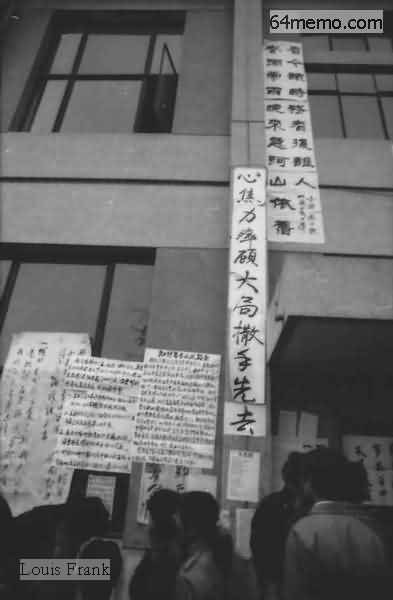

倒下了�o一面民族的旗帜倒下了！

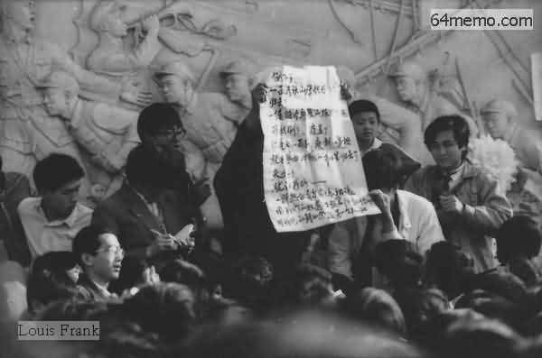

小学生也上街游行支持大哥哥大姐姐的正义行动。他们打出「打倒官倒」的牌子

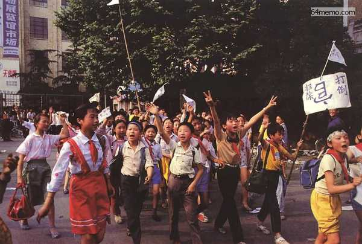

愚民政策该收场了！

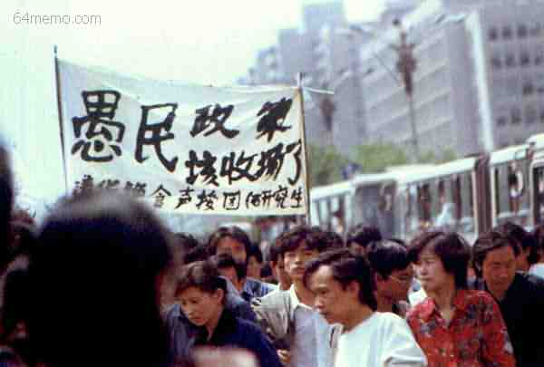

绝食请愿．．．．．．

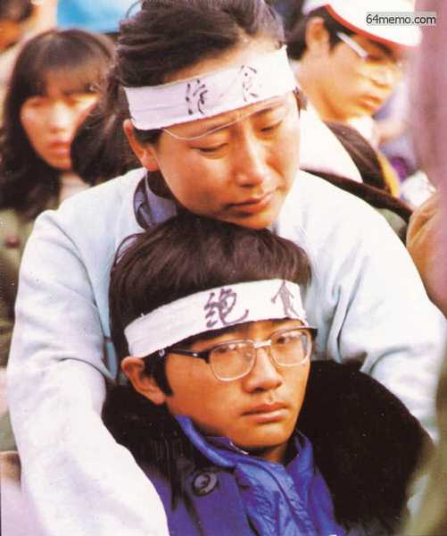

工会声援团--支持绝食学生 “工会来了�u”

僧人重返「红尘」支持绝食学生

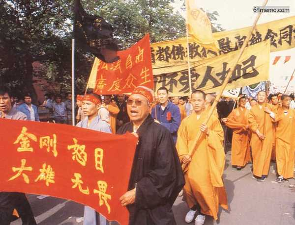

从最传统到最现代的中国人都在广场上找到了共同的目标。一位和尚在天安门广场发表演讲支持学生

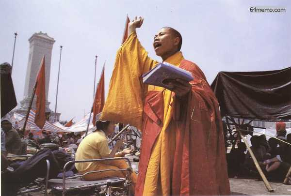

万里说学生运动是爱国行动 ！

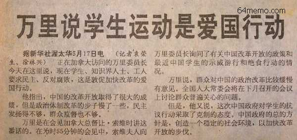

《新华社》1989年5月16日

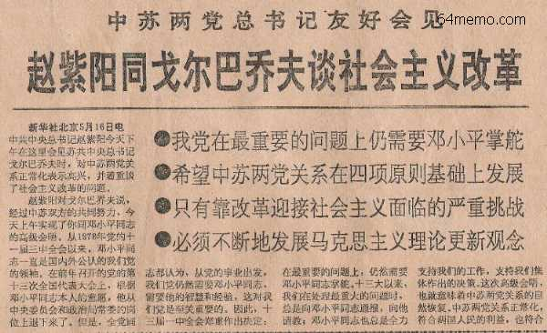

《北京青年报》17日夜在天安门广场进行民意测验――多数认为学运是爱国运动, 请大家仔细看，后面只有7个人认为中共会镇压！

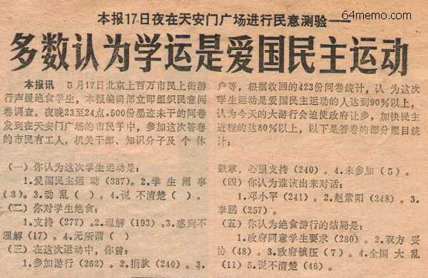

百万人潮！ 

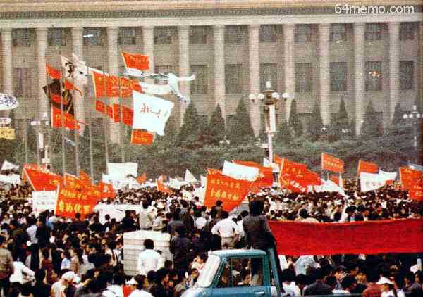

上海外滩，复旦、上海社会科学院队伍，举有“法盲，江泽民，辞职”等指责江泽民不当处理导报的标语

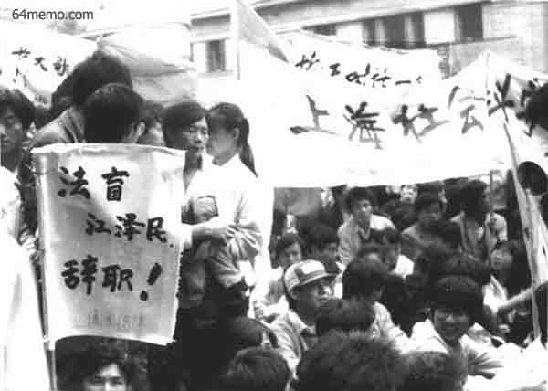

高举的标语上写着：“请问邓小平，我的孩子在绝食、挨饿，你的孩子在干什么！”

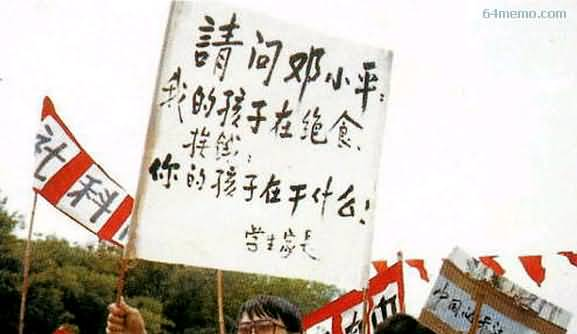

“铲除官倒”！

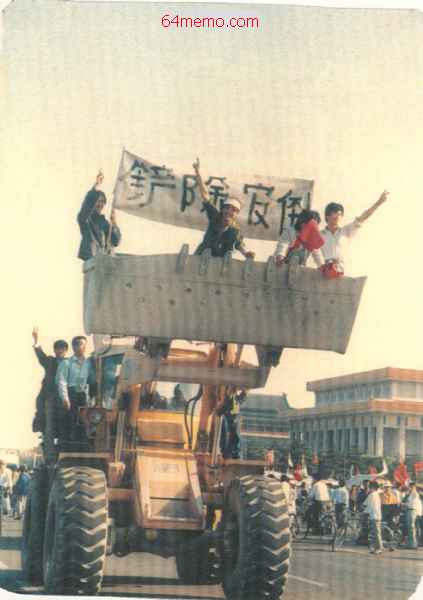

赵紫阳同志代表中央政治局常委发表书面谈话，充分肯定学生的爱国热情,党和政府绝不会“秋后算账”。

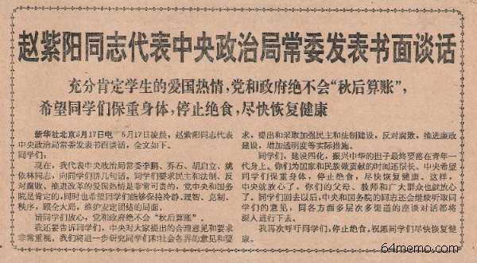

 
  《经济日报》1989年5月19日第2219号 头版。劝食书

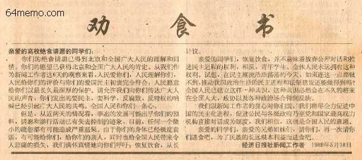

北京大学国际经济系在广场的绝食学生打出横幅�s「我有一个梦」。一百万群众继续游行声援学生；各界知名人士紧急呼吁对话

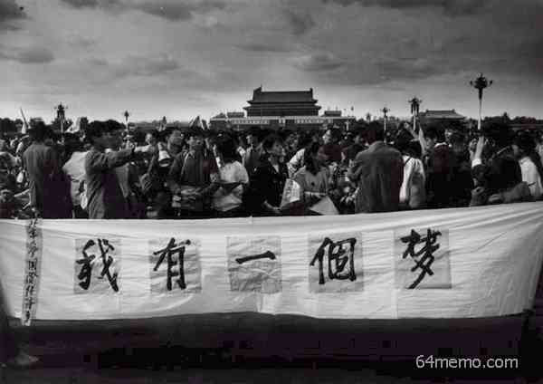

不管大瓶小瓶能装水就有水平不能装水就退瓶

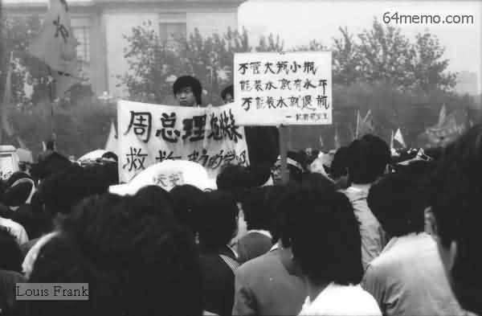

小平您好－－糊涂

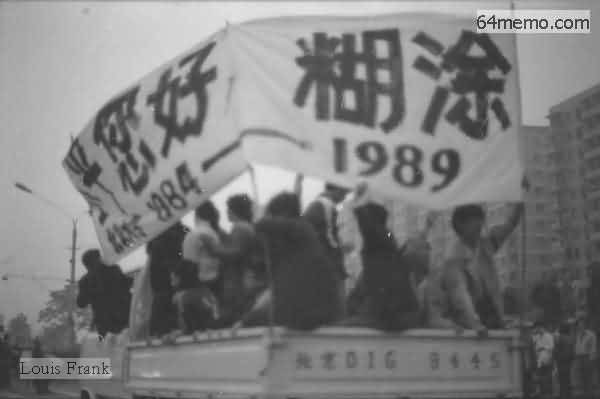

<a href="2.md">下一页－－媒体声援</a>

&nbsp;

