
<h1>六四屠城图片全览 媒体声援</h1>

赵紫阳在中共电视上的最后一次公开露面，随后即被黜，因为他同情学运反对军事镇压，学生们听到这个消息有人哭了，89民运结果竟是为他人作嫁衣裳（苏共和东欧共产党政权的跨台），中国人怎能不悲哀！

[同学们，我们来得太晚了。对不起同学们了……我们已经老了，无所谓了…可是你们还年青啊，未来是你们的，你们要保重身体啊�u]随同赵紫阳的是中共中央办公厅主任温家宝1989年5月19日4时

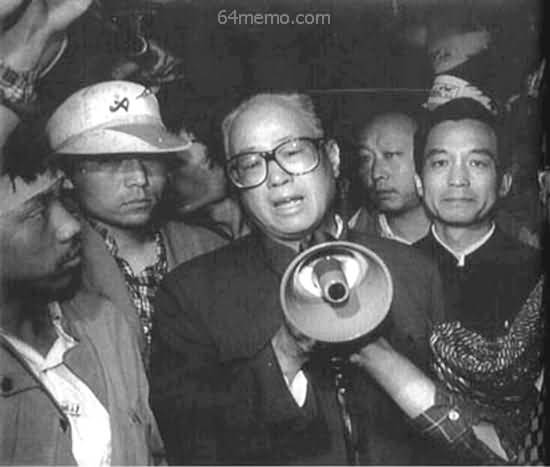 

五月十九日凌晨四时，赵紫阳和温家宝突然来到广场，看望公共汽车上的绝食学生。当时赵紫阳已经遭到中共内部整肃

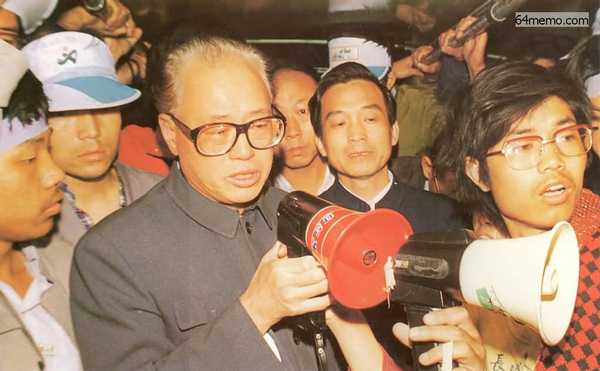

赵紫阳看望绝食学生，并为学生签名

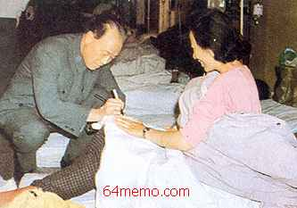

人民团结起来！

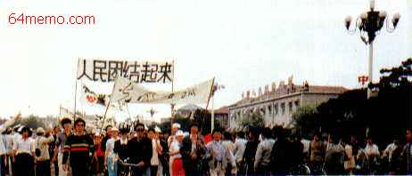

知名人士呼吁!

5月18日，北京长安街头…… 《中国妇女报》1989年5月19日第462号 第四版。 家庭声援 ！

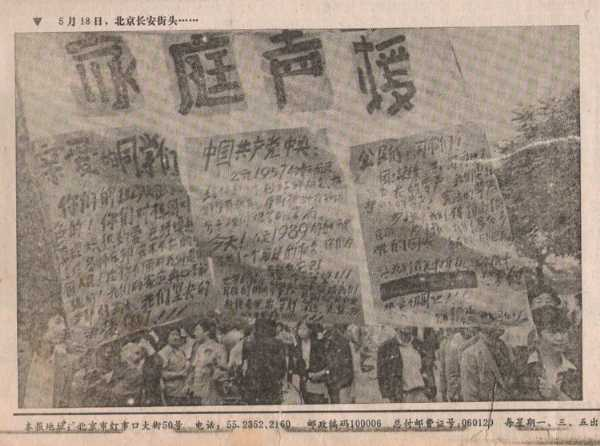

5月18日，上海，上海老新闻工作协会、青年报社等队伍。举的是“新闻要真话，不要检查官”，“自由平等民主博爱”等横幅

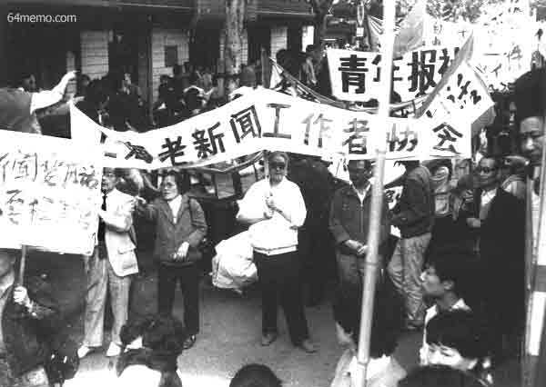

5月18日，上海解放日报游行队伍，持有“中国不要太上皇”横幅

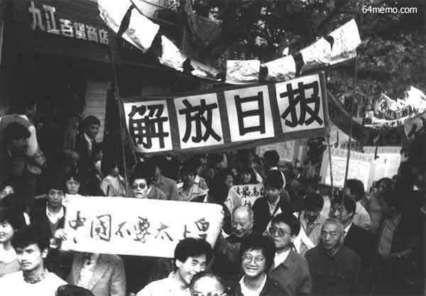

《经济日报》1989年5月19日第2219号 头版 (下)《中国妇女报》1989年5月19日第462号。 赵紫阳说 我们来得太晚了！

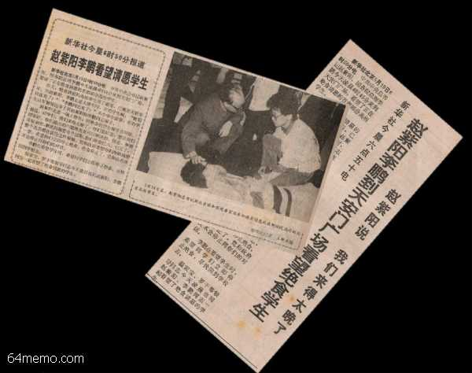

《北京青年报》1989年5月19日第1296期 版页8：5.17大游行剪影

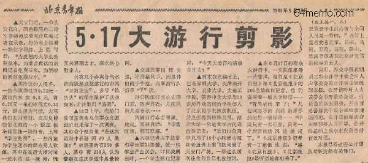

《北京青年报》1989年5月19日第1296期 头版标题

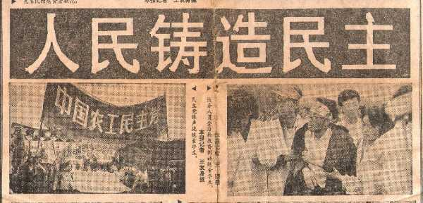

《北京青年报》1989年5月19日第1296期。5.17-5.18百万民众大游行

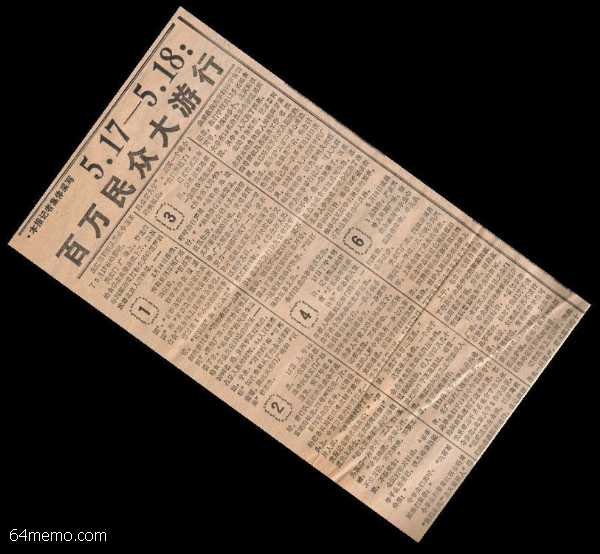

《北京青年报》1989年5月19日第1296期。首都部份新闻工作者疾呼：中央不要失去最后机会!

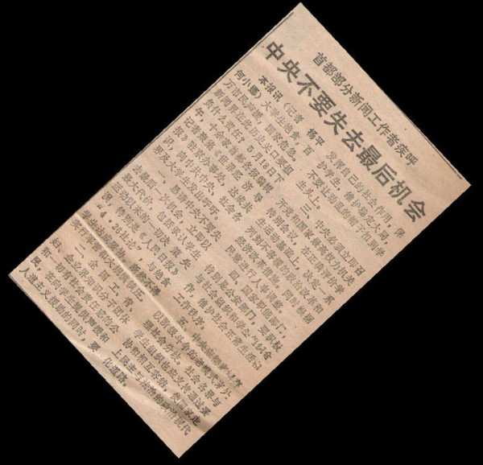

《经济日报》1989年5月19日第2219号 第二版。关于“民主”的思考

<a href="3.md">下一页--专横的戒严令</a>　　<a href="2.md">上一页--和平请愿</a>

