
<h1>六四屠城图片全览 第二编：专横的戒严令</h1>

五月十九日晚十时，李鹏宣布次日戒严，杨尚昆讲话通报了调兵情况。赵紫阳则称病请假三天，没有出席大会

 

&nbsp;

<table width="599" height="21" border="1">
  <tr>
    <th width="278" scope="col">
五月十九日晚十时，李鹏宣布次日戒

    
严，杨尚昆讲话通报了调兵情况。赵

    
紫阳则称病请假三天，没有出席大会

    
杨尚昆，一九○七年生于四川潼南，

    
早年曾留学苏俄，是邓小平的同乡，

    
也是留俄时的同学。学运期间，虽曾

    
对赵紫阳有所同情，但终主张以强硬

    
手段处理，坚称北京戒严是合法而且

    
必要的；五月十九日以中央军事委员

    
会副主席身分宣称北京进入无政府状

    
态，并调派军队进驻北京。
</th>
    <th width="305" scope="col">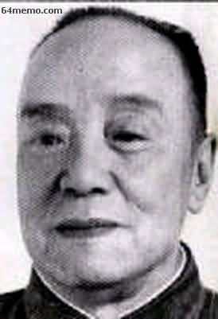</th>
  </tr>
</table>

&nbsp;

<table width="599" border="1">
  <tr>
    <th width="194" scope="col">
<strong>1989年5月20日“这是</strong>

    
<strong>20号上午。</strong><strong>戒严令下达，</strong>

    
<strong>但是戒严部队被全部</strong><strong>堵截</strong>

    
<strong>在北京城外，大约政府方</strong>

    
<strong>面也</strong><strong>没有想到会这样。</strong>

    
<strong>20号白天广场上</strong><strong>空多次出</strong>

    
<strong>现直升机</strong>……”
</th>
    <th width="389" scope="col"></th>
  </tr>
</table>

听到宣布戒严令，学生们宣誓誓死保卫天安门广场

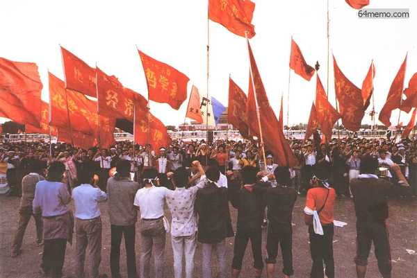

五月二十日戒严后，北京市「全民截兵」，“市民们：这里是军车终点站，绝不准在此通过！” 

北京郊区的一辆公共汽车横在路上，不让戒严部队的军车通过

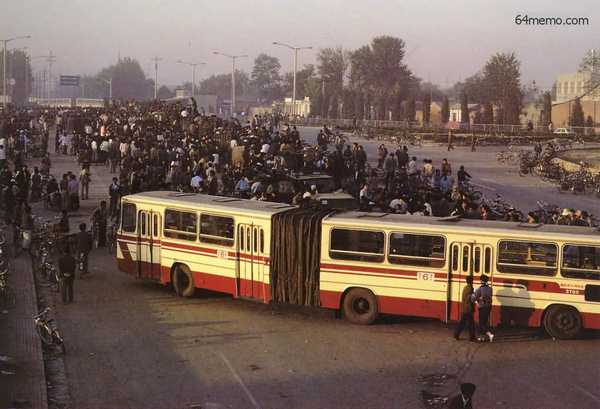

北京市民堵截戒严部队

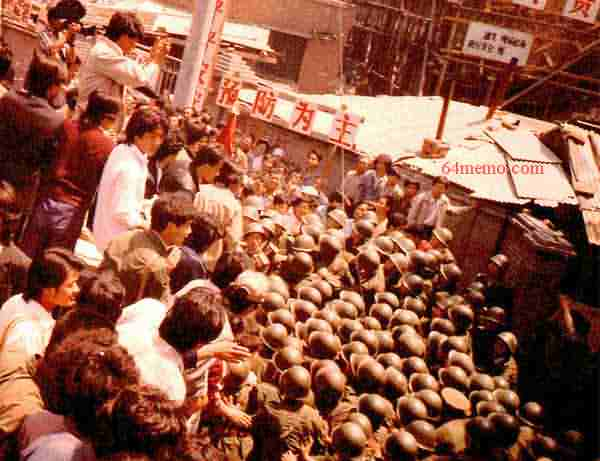

5月21日反对戒严大游行

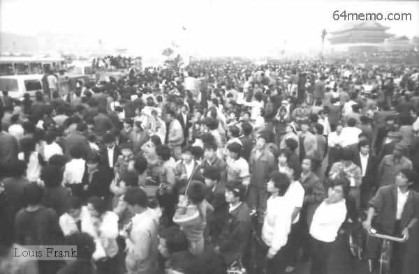

广场上的学生向当局的直升飞机挥舞拳头和旗帜

农民支持我们，工人支持我们，军人支持我们，还怕学生�t--邓小平(4.25)  
谎言被事实戳穿，全民“截”兵，都支持学生。

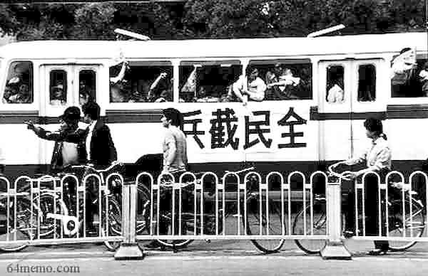

讨李满天下5月20，21日 天安门广场市民骑着三轮车游行，声讨李鹏

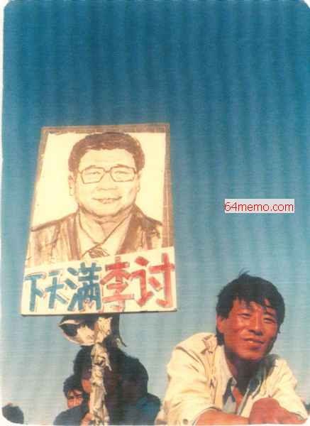

1989年5月25日，上海人民广场.学生们举的是“李鹏发疯，百姓遭殃”；“独夫小平，八四高龄，身体不行，脑瓜不灵，垂帘听政，丧尽人心，快快引退,天下太平”；“国贼李鹏，无德无能，军事管制，党耻国耻，镇压人民，臭名远扬。”等横幅。

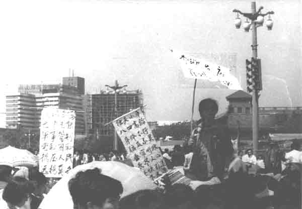

学生劝说戒严部队

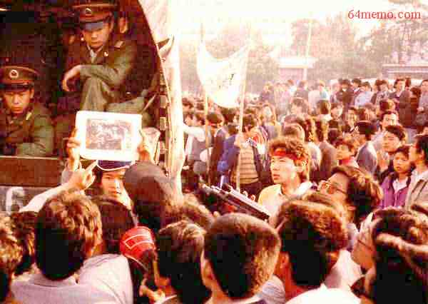

向北京开进的戒严部队的军车被老百姓堵在了郊区

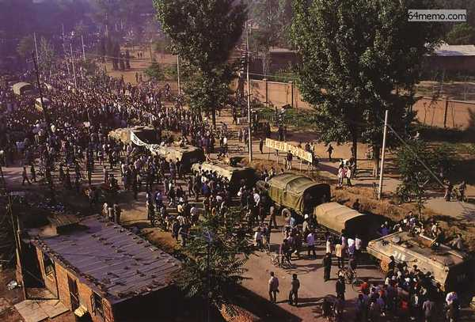

北京市民和学生阻拦军队入城示意图(五月二十日至廿二日)

邓小平下台�u李鹏下台�u

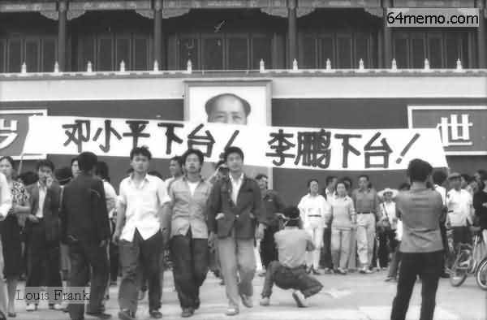

天安门前吊小瓶（小平）

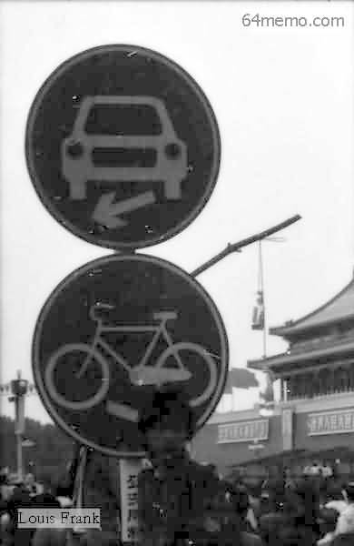

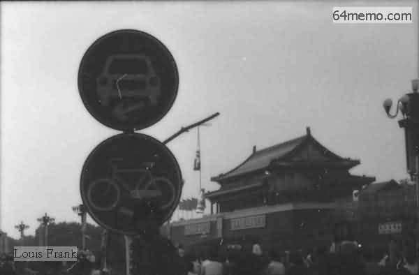

<a href="4.md">下一页--海内外声援</a>　　<a href="2.md">上一页--媒体声援</a>
