
<h1>六四屠城图片全览 海内外声援</h1>

	

五月二十一日,来自日本各地的三千多名学生聚集东京举行示威游行

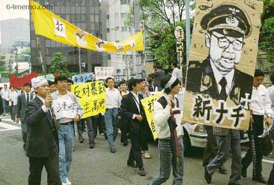

莫斯科留学生游行声援

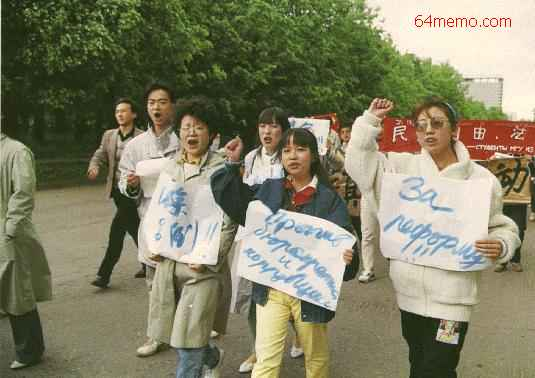

旧金山留学生游行声援

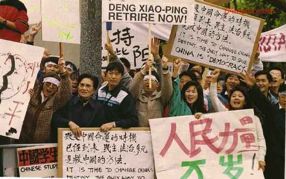 

迈阿密留学生游行声援

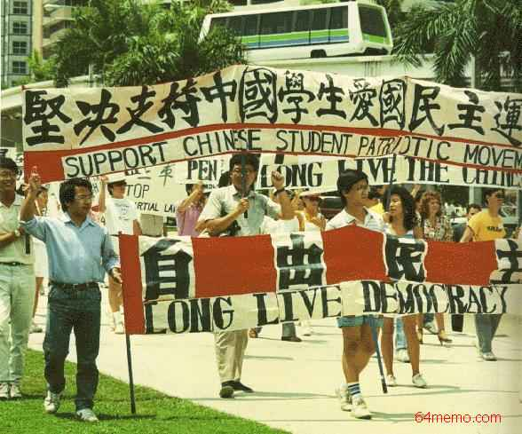

北京机电所:团结起来反对暴政！   

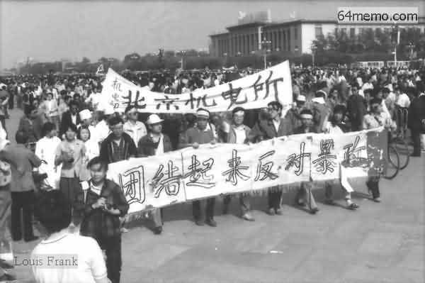 

反对戒严大游行(德国) “声援国内学生民主运动”“结束专制”

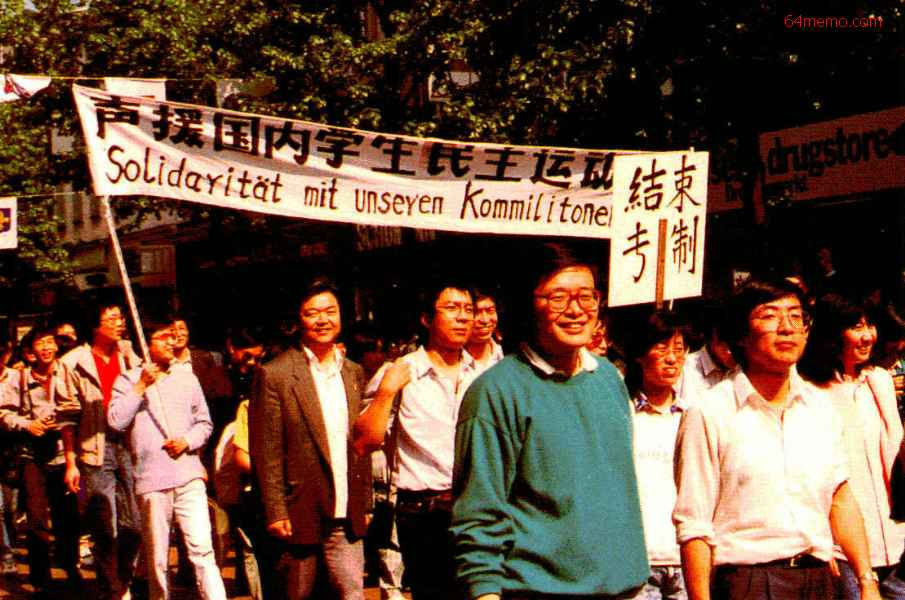

“人民一号令：李鹏无条件下台”

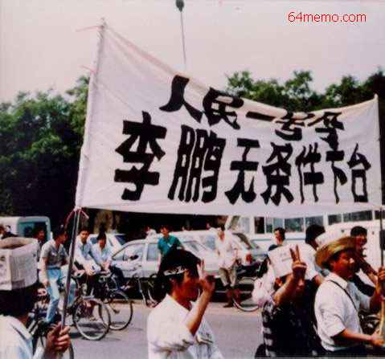

中共中央党校参加游行反对戒严

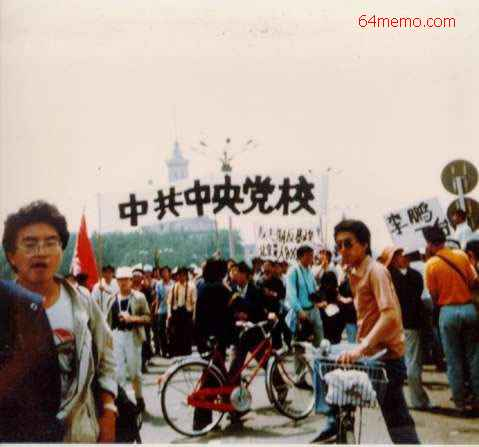

“不是我不明白，这鹏儿太无赖；不是我不明白，这政府太腐败；不是我不明白，这小平忒他妈坏；不是我不明白，这世界变化快。” 

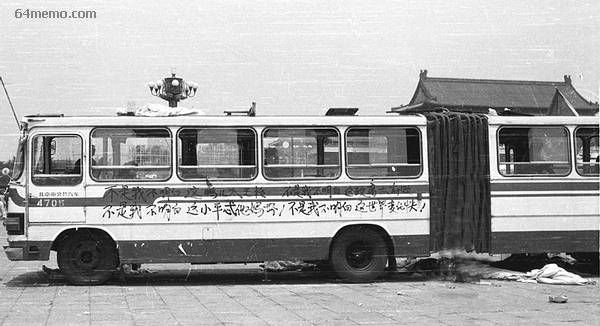

“只要李鹏在，我们天天来”；“旗帜鲜明打倒李鹏--清华大学”

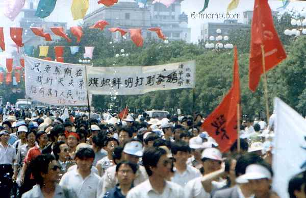

北京警察学校：我们无愧人民

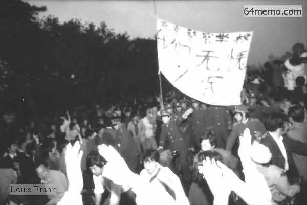

“人民总理应爱人民不要人民不是总理 ,不要政客,不要官僚,要公仆”

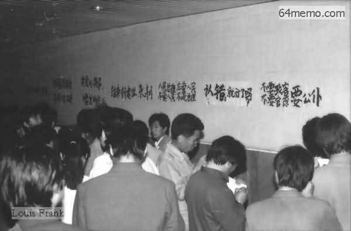

漫画　北京：不需要在枪口下生活

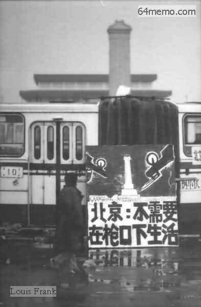

三名来自湖南浏阳的公民向天安门上毛泽东像扔颜料，以示与中共决裂，在场的学生纠察担心当局找到镇压的借口，将三人扭送公安。这三位英雄是：湖南浏阳报社美术编辑喻东岳、浏阳达浒乡涟头小学教师余志坚�p湖南省汽车运输公司浏阳分公司工人鲁德成，他们都被中共长期监禁。

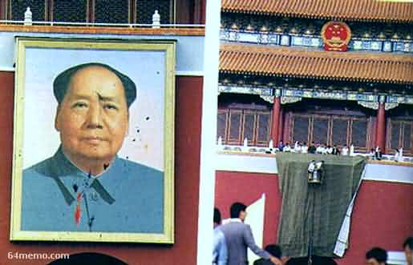

人民日报记者代表手持标语，高呼「取消军管，保卫首都」

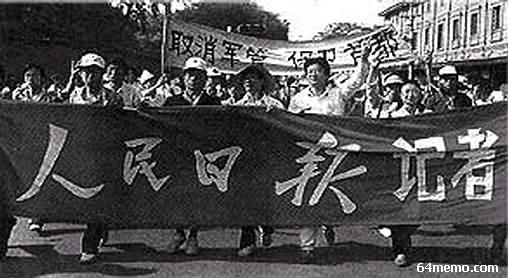

海外马尼拉留学生游行声援 

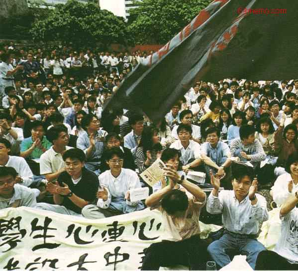

亚里桑那马尼拉留学生游行声援

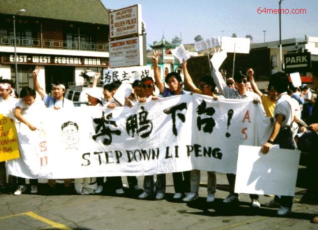

巴黎留学生游行声援

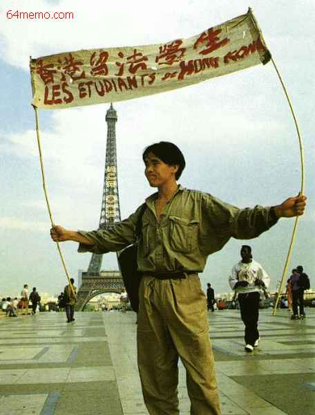

5月25日，上海人民广场，“上海华东师大共产党员 旗帜鲜明反专制 义无反顾争民主”横幅十分醒目

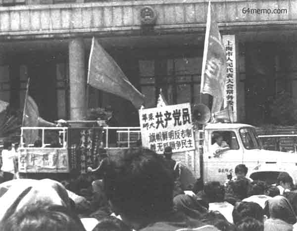

声援广场反对戒严的群众1989年5月26日14时

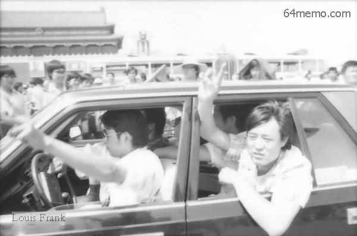

坚决罢免李鹏 撤消戒严

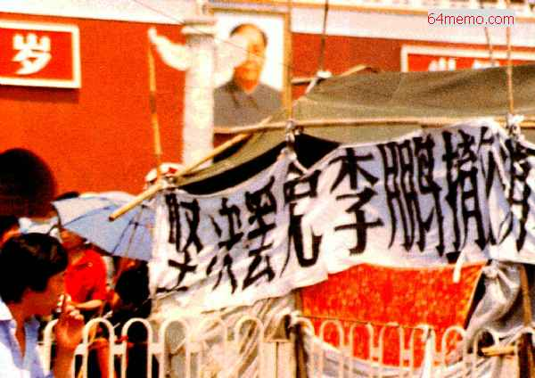

&nbsp;

<table width="600" border="1">
  <tr>
    <th width="167" scope="col">
1989年5月27日19时柴玲，学运时年二十三岁，山东日照人，八七年毕业于北京大学心理系，后就读北京师范大学儿童心理研究所。学运初期担任北大筹委会秘书长，后期担任保卫天安门广场指挥部总指挥。由于柴玲是解放军『清场』时的广场总指挥，六四之后，她被许多人视为这次学运的象征性人物。六四后在国内躲藏十个月，于九○年四月抵达法国，后入美国普林斯顿与哈佛大学，分别获得国际关系和MBA两个硕士学位。现任一家网络公司的CEO。
</th>
    <th width="417" scope="col">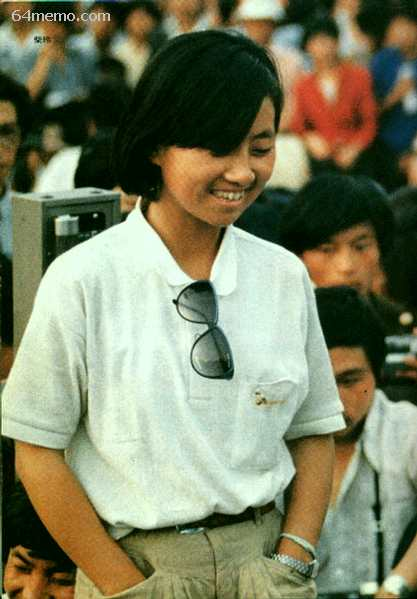</th>
  </tr>
</table>

&nbsp;

<table width="596" border="1">
  <tr>
    <th width="170" scope="col">
1989年5月27日19时王

    
丹，学运当年二十一岁

    
，北京大学历史系一年

    
级学生。学运前参加陈

    
子明�p王军涛『社经所

    
』工作并接掌『民主沙

    
龙』。学运中历任北大

    
筹委会常委�p北高联常

    
委�p陈子明�p王军涛『

    
首都各界联席会议』召

    
集人�p保卫天安门广场

    
指挥部常委。
</th>
    <th width="410" scope="col">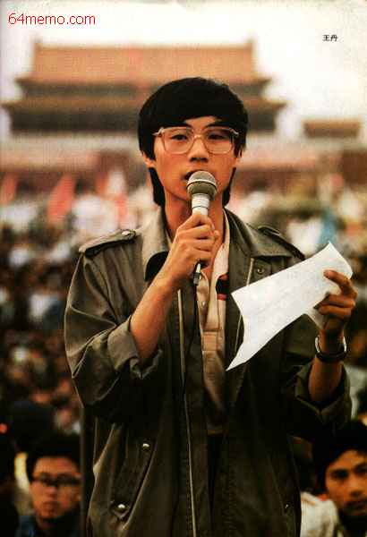</th>
  </tr>
</table>

四君子高新　刘晓波　侯德健　周舵　 

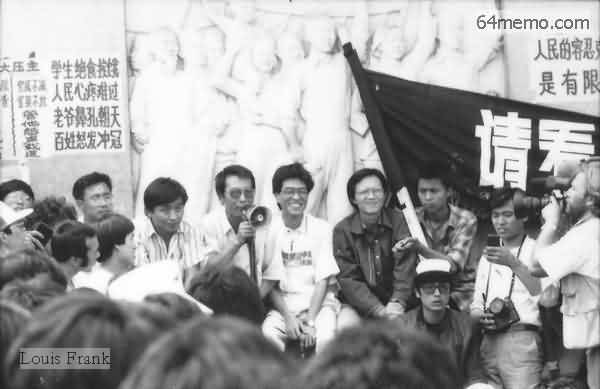

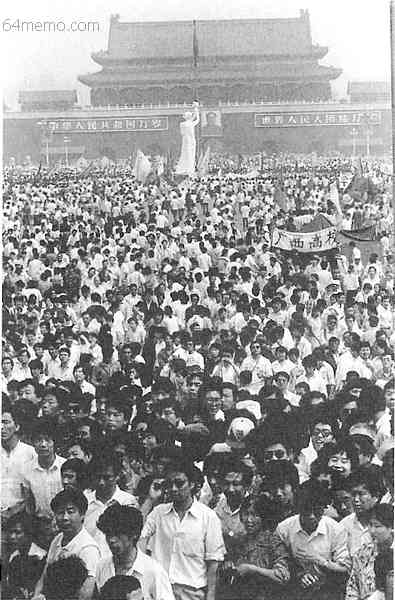

五月二十八日全球华人大游行，北京学生纪念法国大革命二百周年，并要求取消戒严令和罢免李鹏

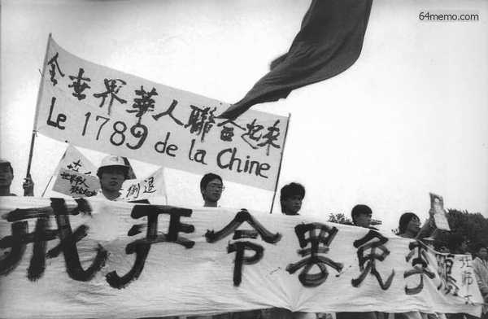

香港学生在北京5月28日

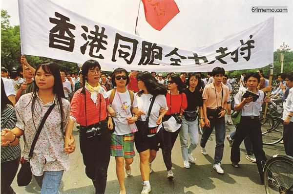

1989年5月29日迫于四二七大游行的压力，中共导演了一场假对话。中共发言人袁木坐在「领导席」向学生训话，学生「代表」则都来自官方学生会。昨天正式成立的北高联不承认这是一次对话。

5月30日，民主女神像在天安门广场上竖立

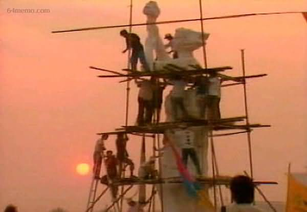

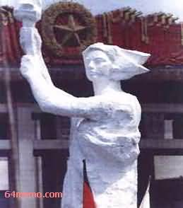

1989年5月30日上海华东纺织学院校园，一个奉命撕毁标语、横幅、大字报的人。近日多个高校开始此类行动

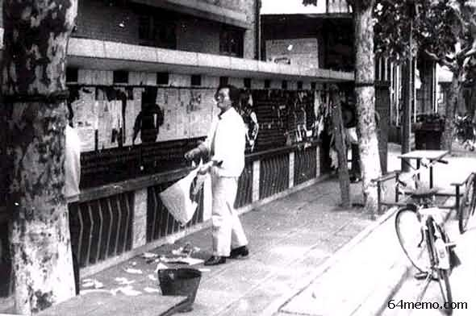

上海一些路段被设置路障，许多汽车电车被刺破轮胎，导致抛锚。据传有个司机对学生进行再教育说：“那（你们）滥戳百戳，每只轮胎戳破伊（它）作啥？只要戳前面一只就来赛（行）了！”

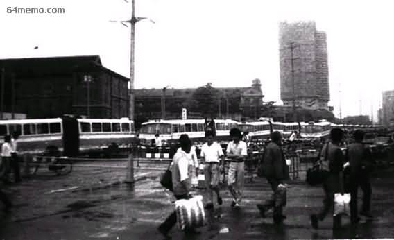

韩东方在北京市公安局门前发表演讲，要求释放被捕的其它工人领袖。当晚，三位工人领袖获得释放

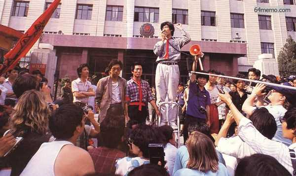

五月三十一日 突然台起强风，夹着大雨，广场上的人担心石膏经不起考验，但是，她奇迹似地屹立不倒

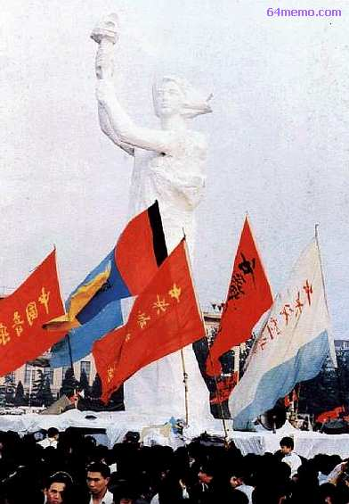

五月二十九日起，纪念碑上贴出「每日财务通报」。财务制度也贴在上面

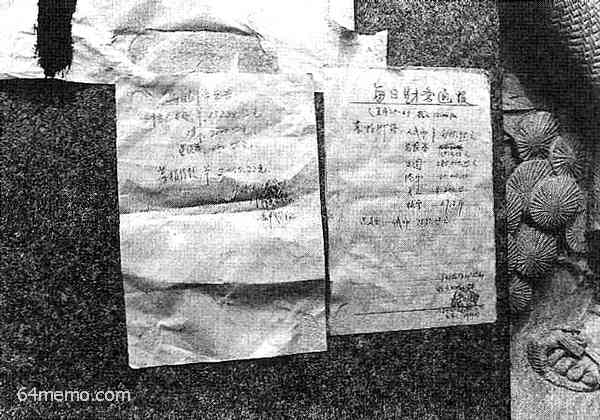

六一儿童节，广场指挥部请小朋友来民主女神像下过节

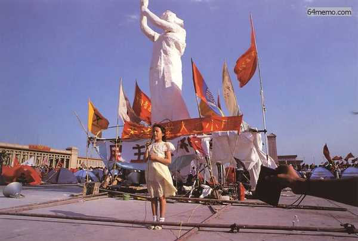

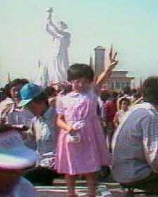

天安门广场上的民主女神像与天安门城楼上的毛泽东画像面对面地对峙，象征着民主与专制的较量

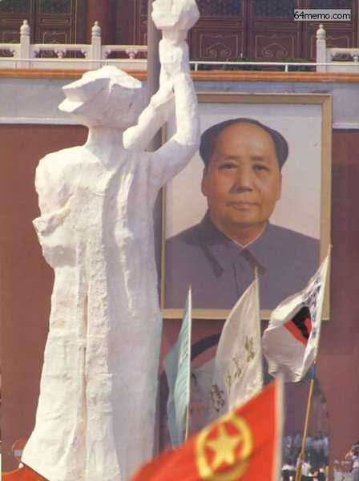

<a href="5.md">下一页--六四血腥大屠城</a>　　<a href="3.md">上一页--专横的戒严令</a>
