
<h1>六四屠城图片全览 第三编：六四血腥大屠城(一)</h1>

6月3日10时48分木樨地一辆戒严吉普车撞死一人创伤四人

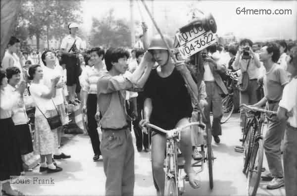 

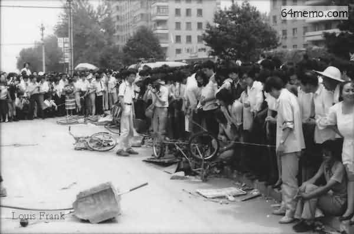

1989年6月3日10时杨建利博士因八九年“六四”时返回中国大陆声援天安门广场学运，随后遭大陆当局列为拒绝入境的四十九人黑名单。2002年4月回国被捕

&nbsp;

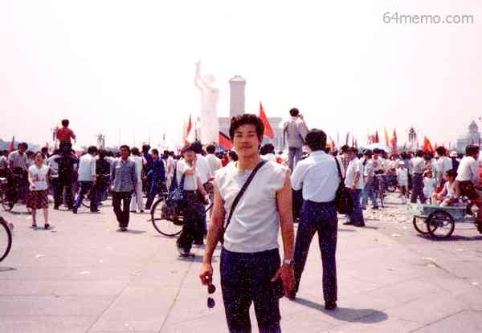

联合报报道当时天安门广场已混进数千便衣部队，伺机扩大事端，以便制造军队镇压的借口

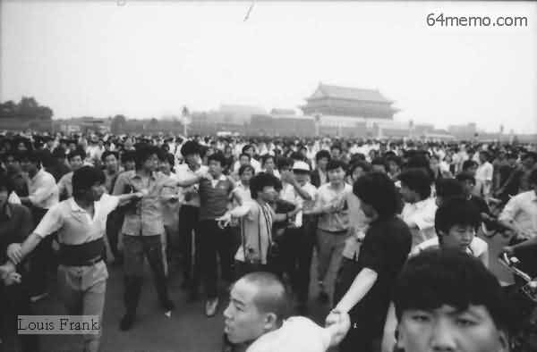

长安街上，载满军人的军车正开往天安门

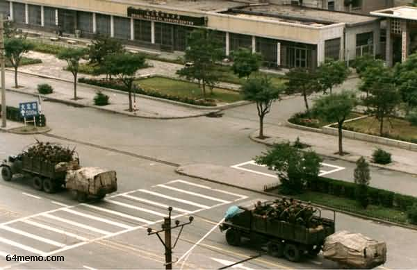

恐怖屠城开始了!!! 

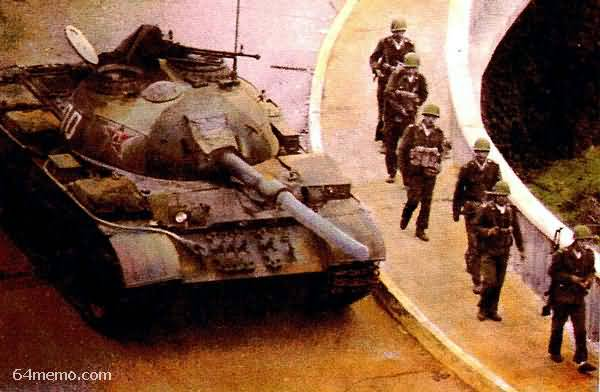

六三下午，一个工人被人大会堂前的军警打伤�o在群众的帮助下出来。他手里的钢盔是在冲突中一个士兵掉下的

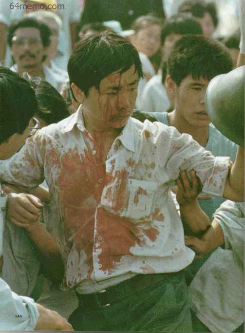

向死难的三市民致哀   

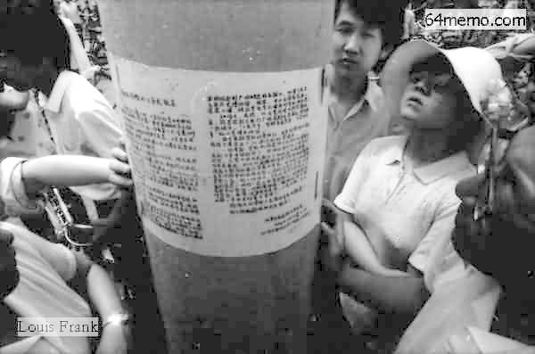

六月三日，大量不知事的「娃娃兵」跑步冲入北京市区.

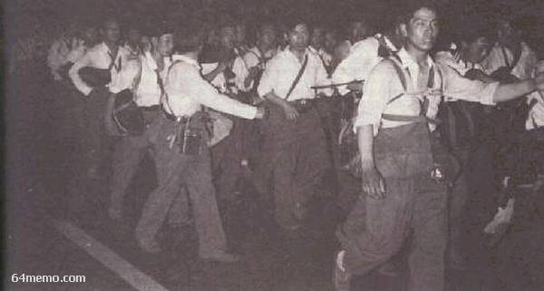

一名学生（右）拉住一名士兵，劝他别去天安门广场

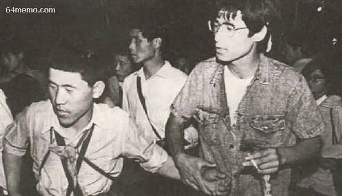

六月三日晚间，台湾学生与北京天安门学生进行「血脉相连，两岸对歌」活动，六月四日清晨，对岸突然没了音讯，原来屠杀已经开始。马英九回忆当时中广主持人大喊：「天哪，他们真的开枪了！」

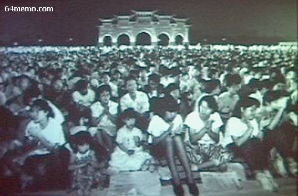

六月四日凌晨2时35分，「民主女神」像成为中共戒严部队进入天安门广场后首先动手的目标－－戒严部队的士兵合力将她拉倒，并且以电视摄影机拍摄拉倒的过程，当天即在中央电视台播放出来

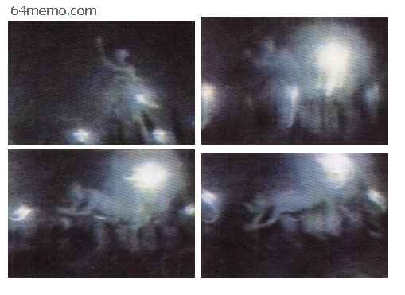

民主女神像被中共戒严部队合力拉倒

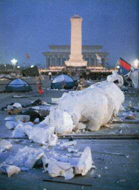

士兵跳过广场路障 

六四凌晨，从人民大会堂冲来的戒严士兵平端着枪对着广场学生扫射!

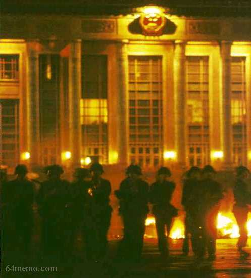

坦克大军疯狂扫射...... 

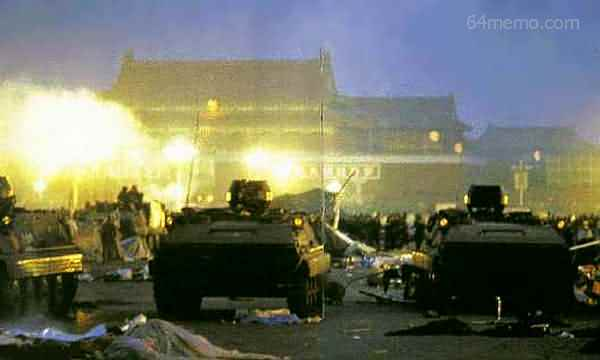

杨建利博士因八九年“六四”时返回中国大陆声援天安门广场学运，随后遭大陆当局列为拒绝入境的四十九人黑名单。背景为六三子夜冲入广场被焚烧的装甲车

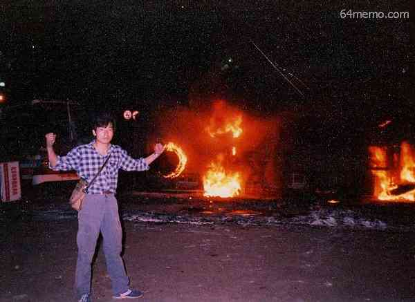

装甲车强行开进广场疯狂射杀，北京市民围在尸体旁发誓要向政府讨回公道

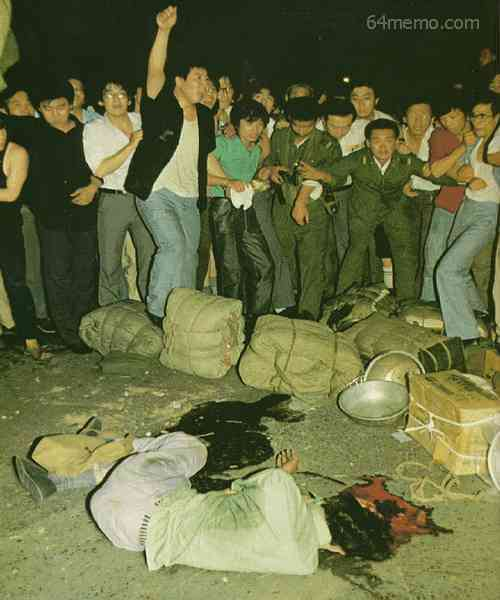

军队向广场上的学生开抢扫射，几位男同学扶着一位受伤女同学赶往医院

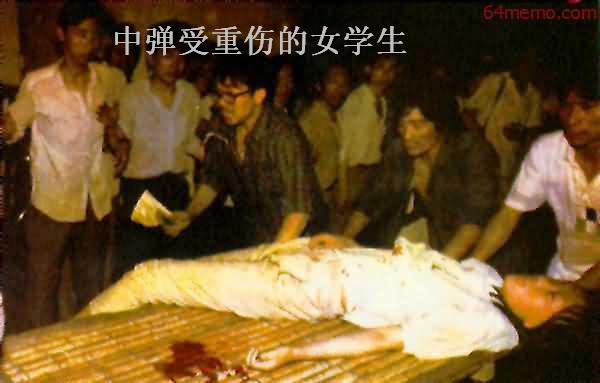

含着眼泪，部分学生们撤离广场(六四凌晨五时)

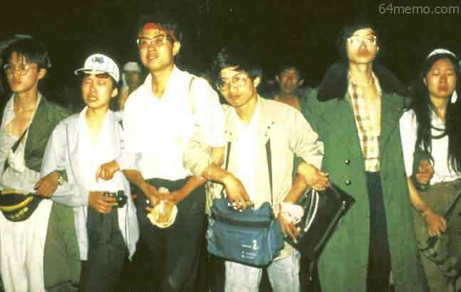

一个孩子哭着抓起碎砖要掷向运兵车，被旁边的学生们劝止

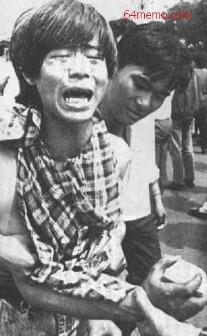

坦克追碾从广场撤离的学生队伍，六部口坦克下的冤魂无数。六四早上军队在长安街上扫射，市民英勇抵抗。照片中可见满街尸体的长安街上，其它人在抢救伤员

坦克下的冤魂

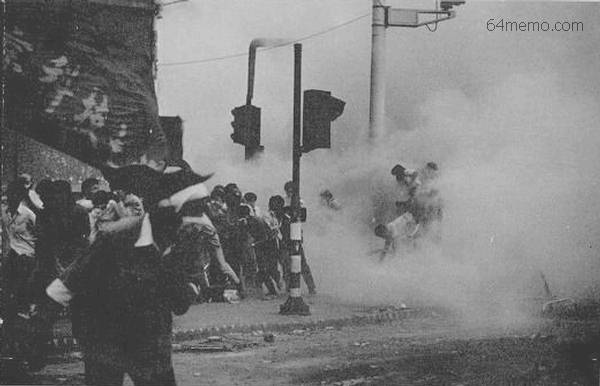

军队清理现场，毁尸灭迹

北京大屠杀（六月三日二十二时至六月五日零时） 

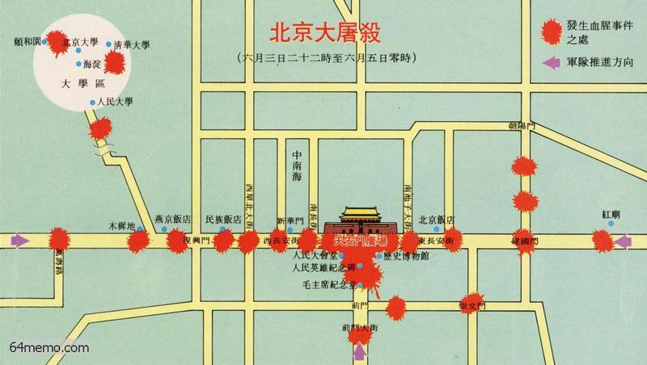

坦克后的尸鸿遍野！

被烧的军车――海淀六四上午海淀路人大附近

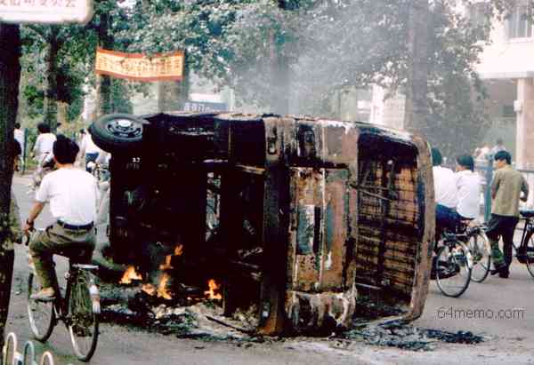

6月4日摄于长安大街的广播电影电视部楼前被焚烧的军车

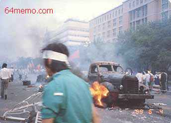

“许多人子弹打到身上�o都还以为是橡皮子弹�u”

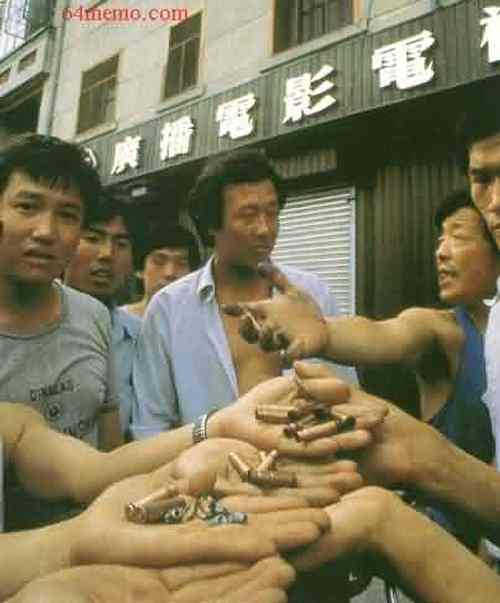

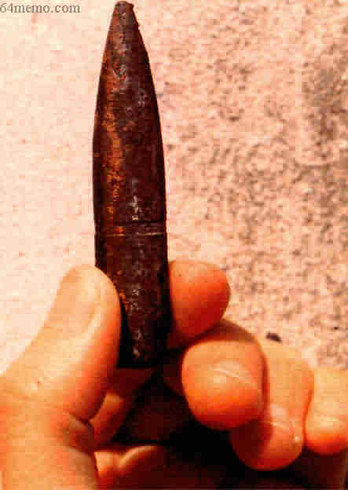

“人民子弟兵”向人民开枪，群众奋勇冒死抢救伤者

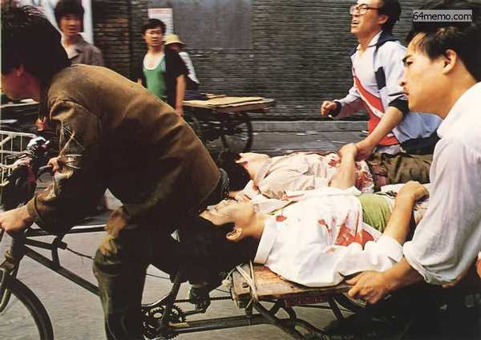

大屠杀之日天亮后，天安门附近布满学生的尸体和自行车残骸（美联社照片）

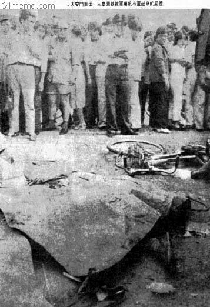

<a href="6.md">下一页--六四血腥大屠城(二)</a>　　<a href="4.md">上一页--专横的戒严令</a>
