
<h1>六四屠城图片全览 第三编：六四血腥大屠城(二)</h1>

大屠杀抛弃在街头的死难者尸体

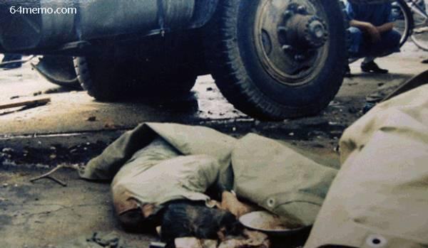 

六四上午，部分学生从广场撤退返校，途经中关村(中穿间条衣服者为柴玲)

西长安街六三晚至六三晨军队与学生�p市民的动向，屠杀主要这在条十里长街上

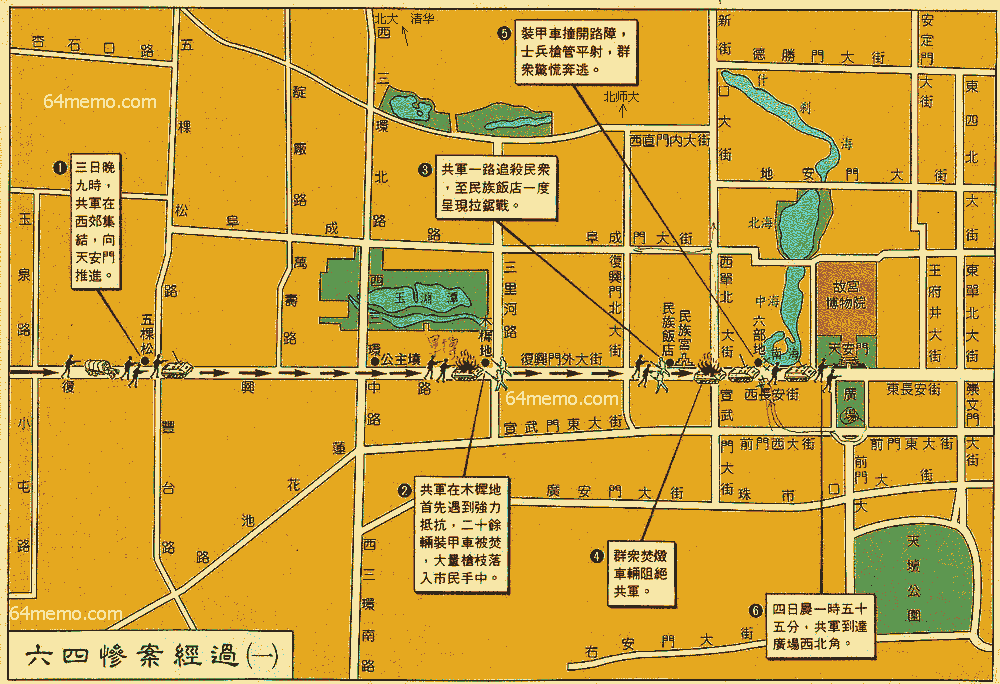

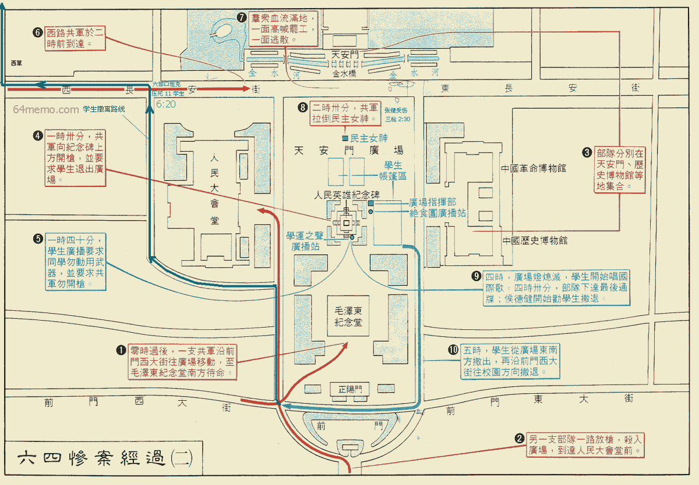�M冲直撞的士兵 

天安门广场上的学生抬着中弹同伴送到医院抢救

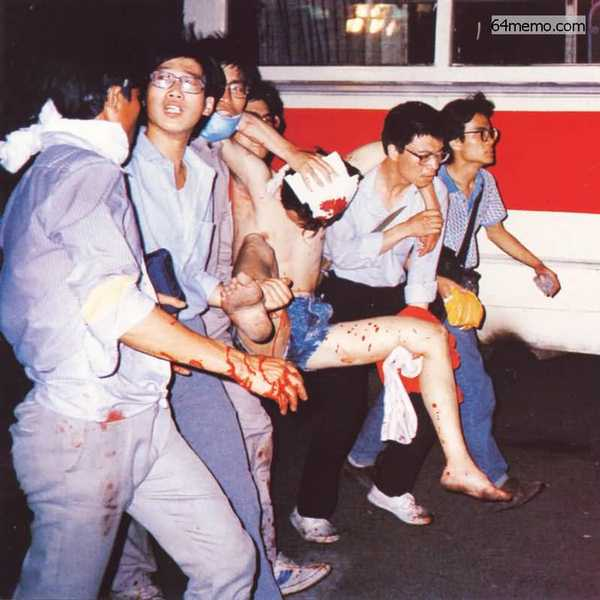

快送他到医院去！ -- 然而，他已停止了心跳和呼吸…… 

救护车上的血迹

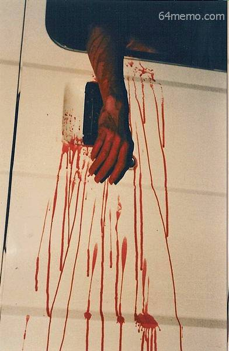

北京死难者的亲属到复兴医院认尸

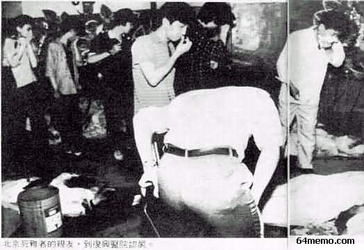

手术台上不治死亡，死难者 -  头部中弹

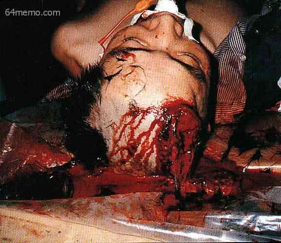

清华大学电子学系硕士研究生，89年6月3日晚，周独自外出，遇戒严部队扫射，头部中弹，死于同仁医院。同年7月6日由校方确认，8日遗体送八宝山火化。

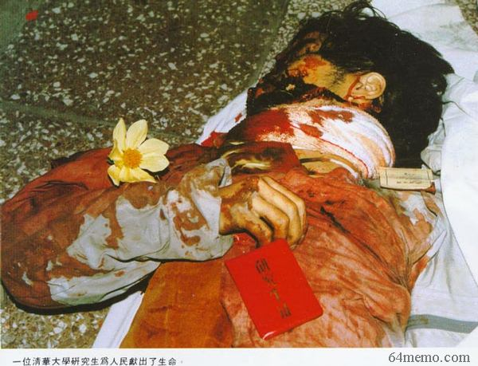

许多六四受难者死于国际禁用的俗称「炸子」的达姆弹。后来北京军医蒋彦永大夫证实当时军队使用了达姆弹

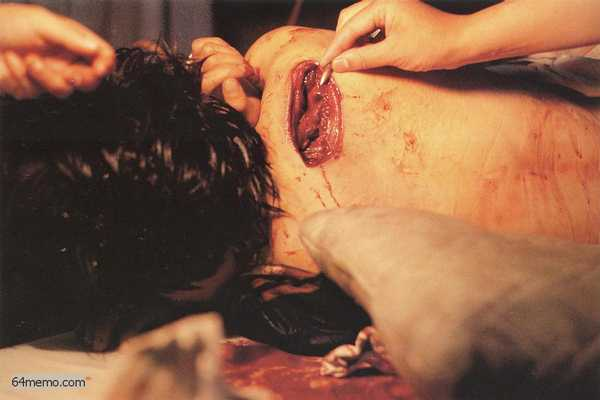

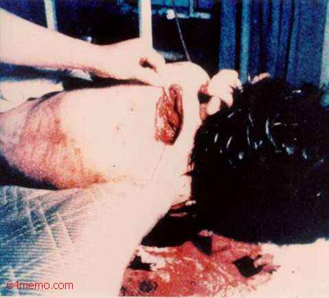

六四上午，北京朝阳医区，一名被害人尸体。估计是国际禁用的达姆弹（开花弹�p炸子儿）或坦克的高射机枪所射杀

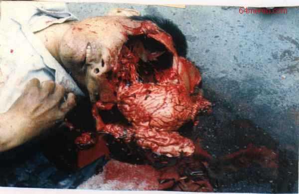

六四上午，北京同仁医院停尸房（距天安门广场一里）柜中的尸体，因冷柜全都装满，这具尸体停在地上

六四上午，北京同仁医院停尸房因冷柜全都装满，这具尸体停在地上2

六四上午，北京同仁医院停尸房因冷柜全都装满，这具尸体停在地上3

鲜红血衣的遇难者1

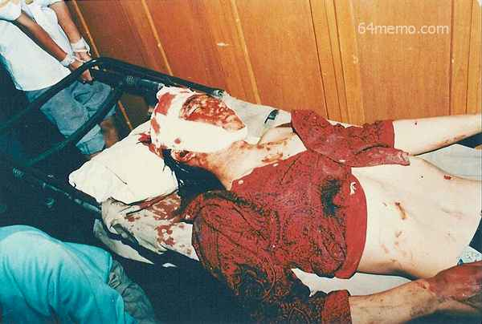

鲜红血衣的遇难者2

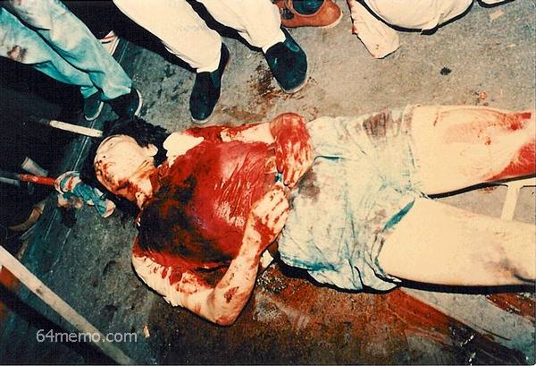

<a href="7.md">下一页--六四血腥大屠城(三)</a>　　<a href="5.md">上一页--</a><a href="6.md">六四血腥大屠城(一)</a>

&nbsp;
