<!DOCTYPE html PUBLIC "-//W3C//DTD XHTML 1.0 Transitional//EN" "http://www.w3.org/TR/xhtml1/DTD/xhtml1-transitional.dtd">
<html xmlns="http://www.w3.org/1999/xhtml">
<head>
<meta http-equiv="Content-Type" content="text/html; charset=gb2312" />
<title>六四屠城图片全览 六四惨案 永不忘记</title>

<meta name="viewport" content="width=device-width, initial-scale=1" />
</head>

<body>

<h1>第四编：六四惨案，中华历史的创伤！永不忘记!！</h1>

部分学生自六四凌晨五点撤离广场，中午才走回北大

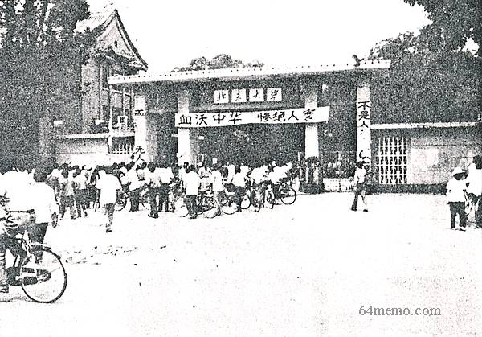 

&nbsp;

<table width="605" border="1">
  <tr>
    <th width="151" scope="col">
「天安门母亲」张先玲之子王楠，在六

    
四事件中遇难时才十九岁。死后尸体曾

    
被集体埋在位于天安门广场西边的第二

    
十八中学门前的土坑。
</th>
    <th width="438" scope="col"></th>
  </tr>
  <tr>
    <td></td>
    <td>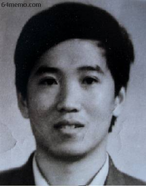</td>
  </tr>
  <tr>
    <td>
刘秀臣和她在六四中遇难的儿子�o戴伟
</td>
    <td>
黄金平与「六四」中死难的丈夫杨燕声的合照
</td>
  </tr>
  <tr>
    <td></td>
    <td></td>
  </tr>
</table>

死难者王建平留下一对孪生女

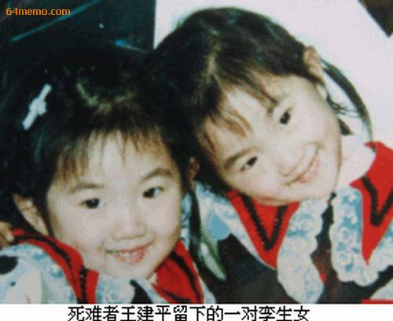

六四被坦克碾掉双腿的体院学生方政：上半身被夹在坦克两条履带中间，两腿不幸被坦克碾压，履带上的链条绞着我的腿及裤子，将我拖出了很长一段路，我奋力挣脱出来滚到了路边....

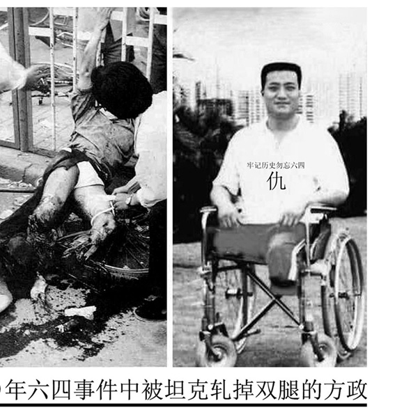

被共军枪击受伤的台湾《中国时报》记者徐宗懋在六月四日前与妻子合影

六四当日的北京师范学院正门“哭我李评�p朱怀峰，血洒中华，何以慰英魂�u”

六四当日的中央财经学院“生的伟大�p死的光荣－－为六四死国难者哀�u”

中国民主的幼苗硬生生让中共一手摧毁，官方媒体并宣扬这群手无寸铁的学生是“反革命暴乱”

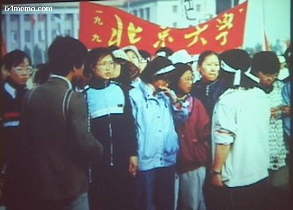

六四天安门事件发生后，台湾青年学生在中正纪念堂声援大陆同胞争民主自由运动

<table width="613" border="1">
  <tr>
    <th width="300" scope="col"></th>
    <th width="308" scope="col">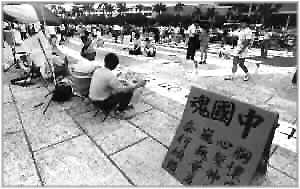</th>
  </tr>
</table>

&nbsp;

<table width="612" border="1">
  <tr>
    <th width="296" scope="col">
全国各大唱片公司旗下的歌手在场高唱爱国歌曲，中国时报发行人余建新，代表国人敲响自由钟声，表达全体中国人的心声。
</th>
    <th width="300" scope="col">
由台湾中国时报及国内新闻媒体共同发起的「自由的怒吼」团结声援大会，在台北中正纪念堂盛大举行，数万民众群聚在一起，对中共血腥镇压行为提出最严厉的控诉。
</th>
  </tr>
  <tr>
    <td></td>
    <td>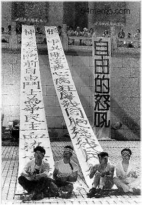</td>
  </tr>
</table>

由台湾中国时报及国内新闻媒体共同发起的「自由的怒吼」团结声援大会，在台北中正纪念堂盛大举行，数万民众群聚在一起，对中共血腥镇压行为提出最严厉的控诉。

<table width="617" border="1">
  <tr>
    <th width="301" scope="col">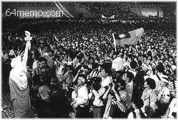</th>
    <th width="300" scope="col">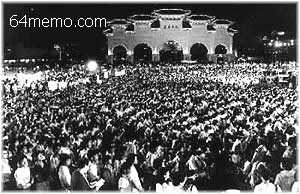</th>
  </tr>
  <tr>
    <td></td>
    <td>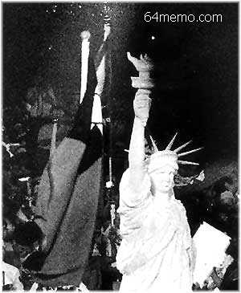</td>
  </tr>
</table>

1989年6月4日，香港的黑色大静坐，群众戴着黑纱，对死难者表示哀悼

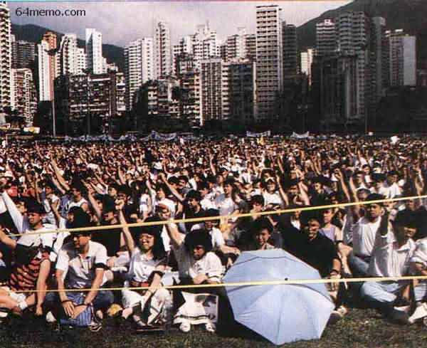

百万人的抗议，包括新华社香港分社在内的中资机构员工，也参加了反对血腥镇压的游行

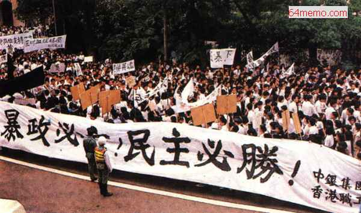

一九八九年六月四日, 美国华盛顿中国大使馆门前进行了大规模示威集会，抗议中国政府屠杀学生的暴行

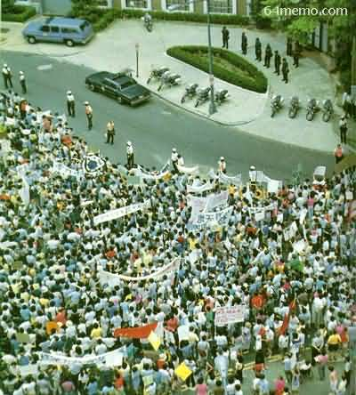

海外多伦多哀悼被屠杀遇害者

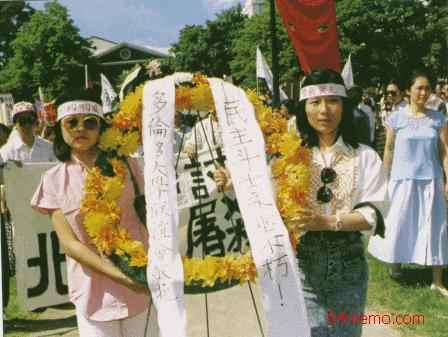

<table width="618" border="1">
  <tr>
    <th width="281" scope="col">
旧金山抗议的人群，排着长长的队伍，向中国城进发
</th>
    <th width="321" scope="col">
留俄学生抗议政府六四屠杀暴行。学生头缠的布带上以俄文写着：『政府应有人性』
</th>
  </tr>
  <tr>
    <td>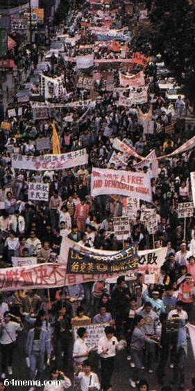</td>
    <td></td>
  </tr>
</table>

六四屠杀后戒严部队士兵持枪在北京街头值勤

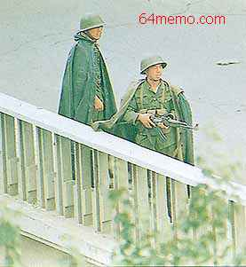

六四后的北京

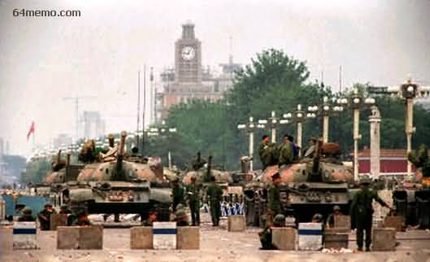

六四后的北京──&quot;清洁&quot;、&quot;卫生&quot;、&quot;优美&quot;的首都

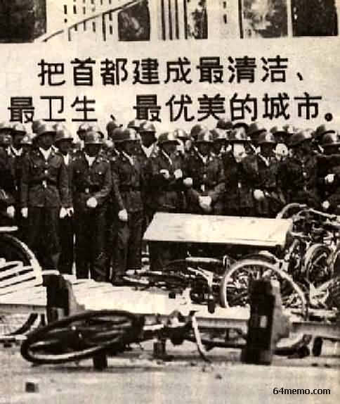

&nbsp;

<table width="587" border="1">
  <tr>
    <th scope="col">
「六四的玫瑰」，希望有一天人们不再

      
担心政府的迫害，可以自由地把由六朵

      
白色和四朵红色的玫瑰组成的玫瑰花束

      
献到天安广场，公开悼念在「六四」屠

      
杀的遇难者。

      
&nbsp;

    

</th>
    <th scope="col">
六四之歌 

      
菲利普．摩根　词曲 图雅　译 

      
一支歌激荡了中国  
        一支歌唱遍了北京  
        在春天，一九八九  
        广场上响彻人的声音  
        世界来到人群聚集的广场  
        去倾听那自由之歌 

      
啊，孩子！  
        热血在广场上沸腾的日日夜夜 

      
广场上等待的眼睛  
        未来应该更好  
        请唱出你内心的声音  
        中国的孩子  
        手握在一起  
        为了中国，自由，为了人 

      
啊，孩子！  
        热血在广场上沸腾 

      
军队开进了广场  
        坦克和装甲车扬起炮筒  
        政府害怕了  
        怕人民的儿女，怕自己的公民  
        但这样还说不伤人叫谁相信，  
        世界上哪能有这样的公平？ 

      
啊，孩子！  
        热血在广场上沸腾 

      
在那个六四  
        一九八九的暮春  
        一个信号发出了  
        死亡令如毒蛇蜿延而行  
        火从枪口喷出，  
        十里长街，倒下年轻的躯体 

      
啊，孩子！  
        热血在广场上流尽 

      
黑夜接续白天  
        枪口对着生命  
        多少人被卑鄙地屠杀？  
        卑鄙的屠杀何时能停？  
        杀人者藏不住  
        他们的肮脏的名字 

      
啊，孩子，  
        历史将记得鲜血在长街上流尽 

      
泪水在流  
        心在痛  
        镇压继续着  
        被驱散的人群隐蔽了声音  
        恐怖只能造成片刻的无言，  
        鲜血却印刷了永久的证明 

      
啊，孩子！  
    我们记得，你的名字是用鲜血写成
</th>
  </tr>
  <tr>
    <th width="292" scope="col">
&nbsp;

    
2005年初，伟大的民主政改先

    
驱赵紫阳去世，他因为六四事

    
件拒绝军队镇压、屠城而被废

    
黜，他在晚年的思想结晶已完

    
全唾弃共产党一党专政的思维

    
圈子，这在《赵紫阳软禁中的

    
谈话》一书中有详述。
</th>
    <th width="279" scope="col">

    </th>
  </tr>
</table>

(全书完)

&nbsp;

&nbsp;

</body>
</html>
